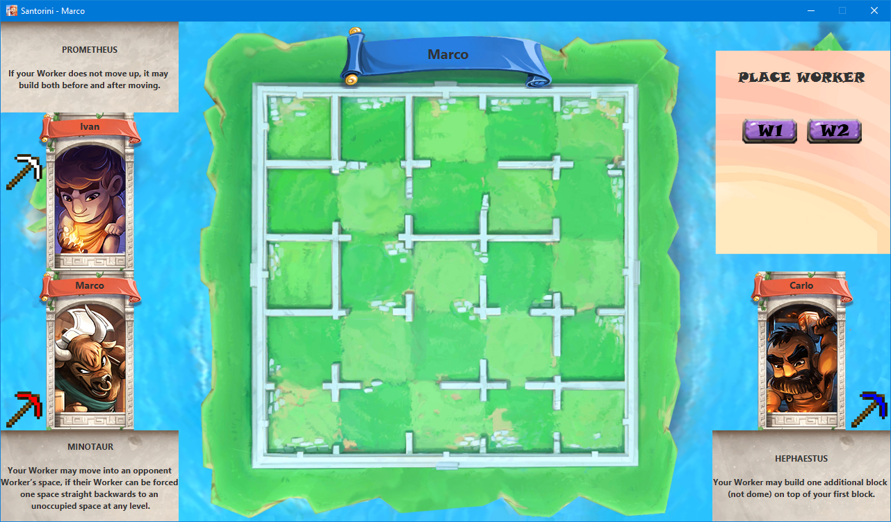

# SANTORINI



## Instructions
### Server
```
java -jar <path-to-server-jar>
```
Example:
```
java -jar V:\GitHub\ing-sw-2020-galvagni-motasov-ottolini\deliveries\final\JAR\client.jar
```
### Client
```
java -jar <path-to-client-jar>
```

Example:
```
java -jar V:\GitHub\ing-sw-2020-galvagni-motasov-ottolini\deliveries\final\JAR\server.jar
```

```
GUI
Type 1 in the console and then hit enter

CLI
Type 2 in the console and then hit enter
```


## Features
* Complete rules
* CLI
* GUI
* Socket
* 1 advanced functionality (Advanced Gods)
###### Created by Marco Galvagni - Ivan Motasov - Carlo Ottolini
